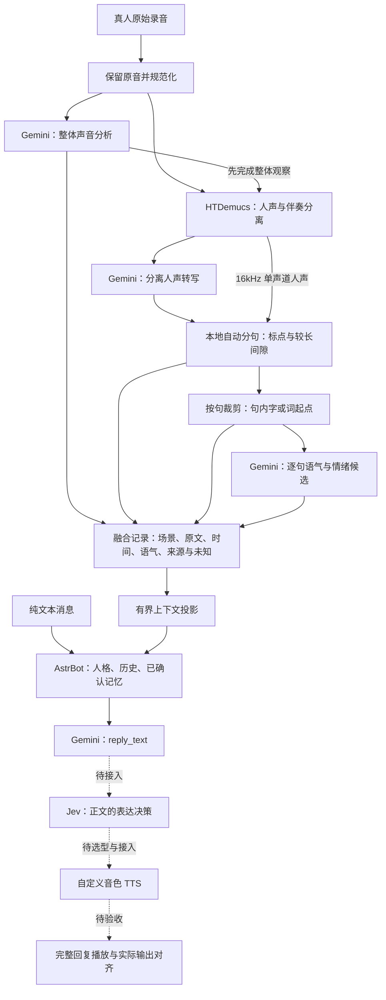
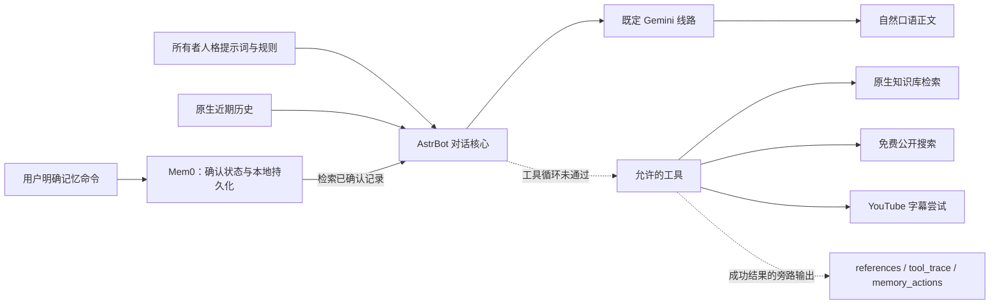

# Mutsumi

Mutsumi 是一个以角色人格为核心的情绪语音助手原型：既理解说话内容，也保留音乐、环境声和人声语气等线索，再结合人格、历史和记忆生成适合朗读的回复。目标是支持自定义音色的完整语音对话，同时保留独立的纯文本聊天入口。

**截至 2026-10-05：已验证音频输入的分阶段分析、原创 Mutsumi 人格回复与长期记忆；完整自动工具聊天和自定义音色回复链路尚未完成。** 当前流程以手动提交整段录音、逐轮处理为主。

## 项目进度

“已验证”表示已有对应的实际运行证据；结构测试、单个样例和用户试听反馈各有范围，不能互相替代。

| 功能 | 当前状态 | 已实现范围与剩余工作 |
| --- | --- | --- |
| 音频接入与规范化 | 已实现 | FFmpeg/FFprobe、原始音频保留、分析音频与时长/采样信息；独立输入分析尚未统一为原音一键入口 |
| 整体声音识别 | 实际请求通过 | Gemini 从原混音提取场景、音乐、环境声等候选；事件时间缺失时明确 unavailable，背景识别仍可能错误 |
| 人声分离 | 已部署，部分素材获用户试听认可 | 本地 HTDemucs 输出人声和伴奏；有背景音乐的真人素材已试验，更多复杂素材质量仍需扩展验收 |
| 分离人声转写 | 实际请求通过 | Gemini 识别人声原文；识别文字仍需人工核对，不由对齐阶段改写 |
| 自动分句 | 本地真实推理通过 | 按句末标点/较长人声间隙提出片段并定位；衣柜例自主得到3句，与用户参考标准比较一致，未把标准答案写入程序 |
| 句内字/词起点 | 已实现，精度部分待听审 | 逐句调用本地 Qwen3-ForcedAligner；保留原生起点，相邻起点构成占用块；重合/整词输出保留 partial |
| 输入情绪与语气 | 实际请求与严格校验通过 | 逐句语气、声音表现、情绪候选、依据和不确定性；不是心理诊断或逐字独立情绪识别 |
| 输入融合 JSON | 已有验收展示与聊天投影 | 整体声音、人声原文、句界、字头、语气与来源一起保存；展示版尚非完整原音生产契约 |
| 人格与文本回复 | 实际 Gemini 回复通过 | 原创 Mutsumi 提示词；纯文本、处理后音频 JSON 共用 AstrBot 核心，输出自然中文正文 |
| 近期会话历史 | 重启验收通过 | AstrBot 原生持久化和截轮上下文管理；原始聊天记录与长期确认记忆分开 |
| 长期记忆 | 实际命令与跨会话召回通过 | Mem0 本地写入、候选确认、纠正、删除、用户隔离；新会话 Gemini 带记忆回复通过 |
| 知识库 | 独立真实检索通过 | AstrBot 原生文档分块、FAISS 与本地嵌入；已导入公开工程说明，返回真实文档/块来源 |
| 联网搜索 | 独立真实查询通过 | DDGS 固定 Yahoo/us-en 免费后端；两次公开查询返回来源，无隐式多引擎回退 |
| LLM 自动工具循环 | 未通过，当前关闭 | 现有 Gemini 线路返回 HTTP503，最小独立 function-calling 请求亦失败；知识库/搜索单独可用不等于模型调用成功 |
| 视频工具 | 部分实现，实际字幕样例不可用 | 仅尝试 YouTube 字幕；未实现画面理解、音轨理解或任意视频站点支持 |
| Jev 回复表达 | 未接入当前核心 | 设计上在 Gemini 正文之后决定表达；回复输出明确 jev_not_connected |
| 自定义音色 TTS | 待比较选型与接入 | 历史 Qwen3-TTS CustomVoice 预设音色 CPU 试部署已合成，不满足最终自定义音色方案；Qwen3-TTS/IndexTTS 比较待做 |
| 完整回复播放与输出对齐 | 未完成真实端到端验收 | 保留服务/浏览器原型；不能把 mock 播放或旧 TTS 试验当当前完整语音链路通过 |

最新证据见 [第03段真人流程](docs/reviews/M02-seven-case03-flow.md)、[自动分句](docs/reviews/M02-automatic-sentence-worker.md)、[句内字头](docs/reviews/M02-character-starts-emotion.md) 和 [聊天核心验收](docs/reviews/M03-astrbot-chat-core.md)。历史失败也保留在验收记录中。

## 项目流程图

实线表示已有实现或分阶段实际接线；虚线表示待完成的接线/能力。图中模块分别可运行，不代表已有从原音到播放的一键生产入口。知识库和工具的模型循环状态见第二张图。





## 模块实现原理

### 1. 音频准备、整体声音观察与人声分离

原始录音与分析副本分别保存，FFmpeg/FFprobe 负责解码、重采样和获取实际音频信息。整体声音观察使用原混音，提取音乐、环境声、音效、非词语人声及不确定描述，避免分离后丢失用户真正听到的背景。整体识别先执行，再处理人声；声音描述由模型提出，不把文件名或素材说明当答案。

[本地分离 worker](tools/vocal-separator/separate.py) 使用 HTDemucs 将混音分为人声和其余伴奏，并保留两路供试听。后续定位使用单声道16kHz人声。该能力是音源分离，不保证区分每个说话人，也不保证带人声的背景歌曲完全消失；分离造成的失真需保留在质量判断中。

整体观察实现与验收见 [整体音频记录](docs/reviews/M02-whole-audio.md)，分阶段集成见 [输入进度](docs/reviews/M02-separated-input-progress.md)。

### 2. 转写、自动分句与句内字头

转写负责“说了什么”，强制对齐负责“这份文字在音频哪里”，两者独立。当前人声转写采用既定 OhMyGPT Gemini 线路；本地定位采用 `Qwen3-ForcedAligner-0.6B` 离线 CPU 路线。对齐不纠正转写，不接受用户参考句子、目标句数或预先缓存的答案。

[分句 worker](tools/local-aligner/sentences.py) 先进行全段对齐，再根据句末标点或超过阈值的模型人声间隙提出分句，并对可修复的句界局部推理。默认间隙阈值600ms，可配置。间隙来自定位结果，不是另一个独立 VAD 已验收能力。裁剪按实际采样帧数生成，输出原文、片段候选时间与诊断；停顿片段不一定都是语法完整的句子。

[句内起点 worker](tools/local-aligner/character_starts.py) 对每句实际裁剪的人声重新推理，只采用模型原生字/词开头。设不同起点为 `s1 < s2 < ... < sn`，占用块为 `[s1,s2)、[s2,s3)、...、[sn,句尾)`。这样连续划分当前句子的已定位部分，间隔中的停顿也归入占用块，**不把它称为每个字的精确发音时长**。句首至首个起点的空白不靠虚构起点填满。

重合起点合并为有不确定标记的组；模型整词输出不平均拆成单字。零/无效边界、无法定位和重合结果保留诊断或 `partial`，不补时间戳。[独立 align.py](tools/local-aligner/align.py) 的严格原生起止校验与起点占用块是不同输出，不能混用。

### 3. 逐句情绪、语气与声音表现

[人声分析 CLI](tools/analyze-vocals.mjs) 依次调用自动分句、句内字头，然后可选调用 [Gemini 情绪适配器](apps/server/src/providers/ohmygpt/ohmygpt-emotion.ts)。情绪阶段接收人声音频与不可修改的句子投影，一次请求返回逐句结果；不重新转写、不改句界、不伪造逐字情绪。

分析分为语气、声音表现和情绪候选：语气可描述解释、疑问、强调或犹豫；声音表现包含感知语速、能量、音高变化、升降调和声音质感；情绪包含标签及愉悦/唤醒倾向。每个非 unknown 判断须有对应依据，缺少依据则明确未知或拒绝结果。描述是模型听感，不是实测 Hz/dB、心理诊断或稳定人格。

设计参考情绪环状模型、韵律和声音质感研究，也考察 openSMILE/GeMAPS、emotion2vec；这些参考方案不等于已安装或接入的独立声学模型。完整依据见 [情绪与语气设计](docs/input-vocal-affect-design.md)，本地契约见 [vocal-affect.ts](apps/server/src/application/vocal-affect.ts)。

### 4. 融合 JSON 与聊天输入

融合记录同时保留整体声音、人声原文、句子、字/词起点与占用块、逐句语气和情绪、来源及未知。背景声音允许与讲话重叠；原音、分离音和结果之间保留引用，便于回听。背景猜测和情绪候选不自动成为长期用户事实。

当前 `audio-context-preview-0.1` 是监督验收展示 JSON，带有 `supervisor_review_projection_not_production_contract` 标记。它是标准 JSON 格式，但不是已经完成的统一生产识别契约。原音整体分析、分离、ASR 与人声 CLI 已分阶段验证，尚未全部纳入一个原音入口。

[聊天客户端](tools/chat-core/chat.mjs) 严格校验版本化的 `mutsumi-chat-input-1`，将展示数据转成有界聊天输入。人格模型接收原文、关键声音和语气摘要、来源与不确定性；完整字头数组、原始诊断、文件路径和密钥留在本地。这样既保留声音线索，也控制上下文体积。两个入口共享同一人格、历史和记忆，不维护两套聊天状态。

### 5. 人格、回复与近期历史

复用 **AstrBot 4.28.2** 的原生人格、历史持久化、上下文截轮、聊天 HTTP API 和工具框架。薄启动器 [run_astrbot.py](tools/chat-core/run_astrbot.py) 负责版本/配置边界、本机监听和既定供应商适配，不重写成熟聊天系统。

首个角色使用 [原创 Mutsumi 人格提示词](docs/personas/mutsumi-system-prompt.md)：温柔安静、表达具体、有自己的看法；允许不同意、澄清和不记得，避免机械安慰或每轮追问。人格规则由所有者控制，示例和虚构设定不能冒充真实共同经历。角色结构借鉴社区角色卡与分层上下文思路，当前不宣称完整兼容所有 SillyTavern 角色卡。设计沿革见 [社区方案](docs/persona-memory-community-design.md) 与 [当前核心设计](docs/chat-core-integration-design.md)。

既定 OhMyGPT `gemini-3.8-flash` 负责自然口语正文，当前近期上下文按24轮截轮管理。客户端处理原生 SSE、响应预算、截止时间和完整结束事件；正文与工具/推理信息分开。单次供应商调用不自动重试或换模型；原生新会话标题生成和工具迭代可能另产生模型请求，所以聊天 HTTP 请求数不等于模型请求总数。

### 6. 长期记忆

复用 **Mem0 OSS 2.2.1 + 本地 Qdrant + FastEmbed 0.8.1**。中文 `BAAI/bge-small-zh-v1.5` 在本地生成512维向量；[记忆服务](tools/chat-core/memory_service.py) 提供鉴权的记忆操作和本地嵌入接口。[AstrBot 记忆插件](tools/chat-core/astrbot_memory_plugin.py) 从真实框架事件获取用户、会话与轮次身份，再检索相关的已确认记录注入当前上下文。

记忆写入使用 `infer=False`，不额外调用云模型抽取或改写事实。模型候选与用户确认分开，候选未确认不能进入正常召回；确认和删除必须来自真人直接命令。用户范围隔离、来源保留、修正和删除都经过实际操作验证。临时检索上下文不另存为新的用户消息。

支持 `/记住 内容`、`/记忆`、`/确认记忆 UUID`、`/修正记忆 UUID 内容`、`/忘记 UUID`。遗忘删除活动检索记录，审计历史和已有聊天记录仍可能保留；不声称安全擦除全部备份。当前确认事实记忆已可用，自动经历总结、衰减策略和更丰富的关系记忆仍是后续工作。

### 7. 知识库与功能插件

知识库复用 AstrBot 原生文档分块、FAISS 和检索管理器，共用本地嵌入服务。公开知识与个人记忆分开；只检索所有者选定的知识库，返回实际文档/块标识。原生融合排序分不当作正确概率。[公开工具插件](tools/chat-core/astrbot_public_tools_plugin.py) 负责预算、超时、来源投影和能力边界。

搜索复用 **DDGS 9.16.0**，固定已验证的 Yahoo/us-en 后端，调用前检查后端确实存在，避免静默切换；查询不得附带完整私人对话。视频复用 **yt-dlp 2026.8.19**，仅尝试受限 YouTube 字幕获取，不下载媒体或浏览器 cookies。当前实际视频样例没有取得可用字幕，视觉与声音理解保持 unavailable。

现有 Gemini 的自动 function-calling 请求返回503，完整工具循环未验收。当前人格 `tools=[]`，暂时关闭模型调用工具；记忆自动上下文和明确命令仍保留，知识库/公开工具插件仍安装。不能因独立检索成功而声称角色已经搜索过或看过视频。

### 8. Jev、自定义音色与输出时间轴

计划保持 **Gemini 先决定正文，Jev 再决定这份正文的表达**，表达阶段不能悄悄重写回复。TTS 适配器随后把表达映射到实际引擎支持的情绪、语速、重音或停顿控制；不支持的控制项明确 unavailable。

历史 [Qwen3-TTS worker](tools/local-tts/synthesize.py) 使用1.7B CustomVoice预设 Serena 女声、CPU FP32，已实际生成中文 WAV，但不是自定义音色最终方案。后续先比较 Qwen3-TTS 与 IndexTTS 的声音定制、中文表现、情绪控制、硬件成本和使用条件，再部署选定方案。历史试部署证据见 [TTS 记录](docs/reviews/M04-local-tts.md)。

生成后的音频按真实帧数报告时长；字词时间需来自 TTS 的实际输出或后置对齐。合成前表达计划、期望停顿和输入录音的字头均不能冒充输出实测时间。当前聊天结果明确 `expression=unavailable/jev_not_connected`、`tts=unavailable/not_requested`。

## 数据与目录

| 路径 | 用途 |
| --- | --- |
| `apps/server/src/application/` | 供应商无关契约、严格校验与应用基础模块 |
| `apps/server/src/providers/` | 云端识别、情绪和回复适配器，隔离供应商协议 |
| `tools/vocal-separator/` | 本地人声分离 worker |
| `tools/local-aligner/` | 本地对齐、分句、句内起点 worker |
| `tools/analyze-vocals.mjs` | 已分离人声与原文的统一分析 CLI |
| `tools/chat-core/` | AstrBot 接线、聊天客户端、Mem0 服务与薄插件 |
| `tools/local-tts/` | 历史本地 TTS 试部署 worker |
| `docs/personas/` | 原创角色设定与提示词 |
| `docs/tasks/`、`docs/reviews/` | 编码任务与独立验收证据 |
| `data/`、`.runtime/` | 忽略提交的录音、私有结果、运行记录与环境 |

聊天输入和输出分别使用 `mutsumi-chat-input-1`、`mutsumi-chat-output-1`。输出的 `reply_text` 供 TTS；`references`、`tool_trace`、`memory_actions` 是旁路数据，不朗读原始工具结果。完整字段及限制见 [客户端任务](docs/tasks/M03-astrbot-chat-client.md) 和 [工具引用任务](docs/tasks/M03-chat-tool-references.md)。

## 本地准备与运行入口

需要 Node.js 24 或更新版本、npm，以及音频处理所需的 FFmpeg/FFprobe。本地 Python worker、模型和 AstrBot/Mem0 依赖使用各自隔离环境；`npm ci` 不会安装全部语音模型。先阅读 [设备交接](docs/device-handoff.md)，在新设备重新检查硬件、磁盘和环境，不沿用旧机器结论。

```sh
npm ci --ignore-scripts
npm run check
```

将 `.env.example` 复制为 `.env`，按使用模块配置密钥和路径。不要把 dotenv 内容作为代码执行。以下命令中的 `data/` 文件由用户自行准备，不随仓库提供；输出目录每次使用新的路径。

### 已分离人声分析

输入是单声道16kHz人声 WAV 与完整 UTF-8 原文；文本 JSON 仅使用 `{"transcript":"原文"}`。先确认本地对齐环境和权重已按交接文档恢复。

```sh
node tools/analyze-vocals.mjs --audio data/vocals.wav --text-file data/transcript.json --output-dir data/vocals-run-001
```

默认仅本地分句和起点处理；CLI 不自动读取 `.env`。加 `--emotion` 才使用进程中的 `OHMYGPT_API_KEY` 调用云端情绪分析，要求音频不超过30秒且句界完整可用。输出有阶段 JSON、裁剪音频和 `result.json`，失败保留已完成阶段及 `failure.json`；退出0仍需检查 `partial`，不能视为所有字头精度通过。独立环境路径可通过 CLI 配置，`--help` 查看参数。

### 人格聊天

先启动已恢复的 Mem0 和 AstrBot 本地服务。当前部署端口分别为6186、6185，恢复步骤与私有配置见交接文档；令牌不包含在仓库中。客户端进程需设置 `MUTSUMI_CHAT_BASE_URL` 和 `MUTSUMI_CHAT_API_KEY`，不自动加载 `.env`。

合成的纯文本输入格式示例，不是实际用户记忆或验收记录：

```json
{
  "schema_version": "mutsumi-chat-input-1",
  "mode": "text",
  "user_id": "demo_user",
  "session_id": "demo_session",
  "text": "你好，今天想聊一聊读书。"
}
```

```sh
node tools/chat-core/chat.mjs --input-file data/chat-input.json --output-dir data/chat-run-001
```

输出目录必须尚不存在，由客户端创建；得到 `result.json` 与 `reply.txt`，失败保留通用原因。处理后的音频输入可由客户端导出的 `projectAudioPreview` 转成正式聊天契约；当前不提供原音直接聊天的一键命令。

### 保留的服务与试听原型

`npm start` 启动已有 HTTP 原型，`npm run start:mock` 是明确标记的开发演示，不能代表真实全链路。私有试听页 `http://127.0.0.1:8770/` 在 QA 服务运行时提供原音、人声、伴奏、分句、字块与语气对照；它依赖本机私有素材，不是仓库自带的公开产品网站，换设备需重建服务。

## 接下来要实现的功能

| 工作 | 实施目标 | 验收标准 |
| --- | --- | --- |
| 工具调用兼容性 | 在所有者选择范围内比较 Gemini 线路，接回原生工具循环 | 真实模型调用知识库/搜索并产生有效引用；失败如实输出，无假成功 |
| 原音统一入口与正式融合契约 | 将整体观察、分离、转写、人声分析及聊天投影统一编排 | 新真人音频无需监督手工拼接；逐阶段可追溯、失败保留结果 |
| 更多输入质量验收 | 扩大口音、背景人声、音乐、短句与多人场景 | 核对原话、分句、字头与语气，记录错误和不确定性 |
| 更完善的人格与记忆 | 可版本化角色配置，完善经历/关系记忆、冲突和上下文策略 | 多轮人格一致、记忆有来源、可纠正/遗忘，不编造共同经历 |
| 视频理解 | 分别实现字幕、画面和音轨能力 | 对真实可访问视频逐项验证，不能用字幕成功代替视觉验收 |
| Jev 表达 | 对已生成正文独立决定表达并映射控制参数 | 正文不改写，失败明确 unavailable，实际控制能力可验证 |
| 自定义音色 TTS | 比较后部署选定引擎，接通回复合成 | 真人试听中文发音、音色一致性和表达；记录实际速度与资源使用 |
| 播放与输出对齐 | 完整录音轮次、真实回复播放、实际音频时间轴 | 输入到播放真实端到端通过，计划时间与测量时间分开 |

以上是路线图，不表示新模型、收费服务或新增供应商已经获选。当前范围不包含实时流式录音、自动轮次检测和打断。

## 开发与验收约定

应用代码由 **ChatGPT 认证 Codex CLI 的 gpt-6-luna** 编写，监督者负责设计、逐文件提交、部署和独立验收。每次实际修改一个受跟踪文件后立即单独 Git 提交，再继续下一文件；文档整理由监督者完成。编码模型与运行时语音/对话模型分别选择。

```sh
codex login
node tools/harness/run-luna.mjs --check
# 仅执行已经指定范围的任务
node tools/harness/run-luna.mjs docs/tasks/TASK.md --effort=medium --timeout-ms=600000
```

最近对应代码验收记录中，TypeScript 构建及287项既有测试通过，聊天客户端42项独立检查通过，公共工具33项独立检查通过。它们验证结构、协议和边界，不替代真人录音/听审或云端工具循环验收；本次 README 整理不重新宣称执行这些测试。

`.env`、私人录音/会话、原始响应、模型、数据库、虚拟环境与编码日志不进入 Git。用户已授权后续 GitHub 同步，当前仍未实际推送，本地提交不能当远端已同步。

## 进一步阅读

- [已确认决策](docs/decisions.md)：模型、任务范围与方案选择以最新决策为准。
- [架构](docs/architecture.md) 与 [接口契约](docs/contracts.md)：模块职责和数据边界。
- [设备交接](docs/device-handoff.md)：环境恢复、私有数据与迁移注意事项。
- [聊天核心设计](docs/chat-core-integration-design.md) 与 [验收](docs/reviews/M03-astrbot-chat-core.md)：成熟组件集成及真实阻塞。
- [情绪与语气设计](docs/input-vocal-affect-design.md)：研究依据、工程词汇和未知规则。
- [历史可编辑流程草案](voice-system-flow.md)：包含较早下游设计；当前实现状态以本 README 和最新验收记录为准。
