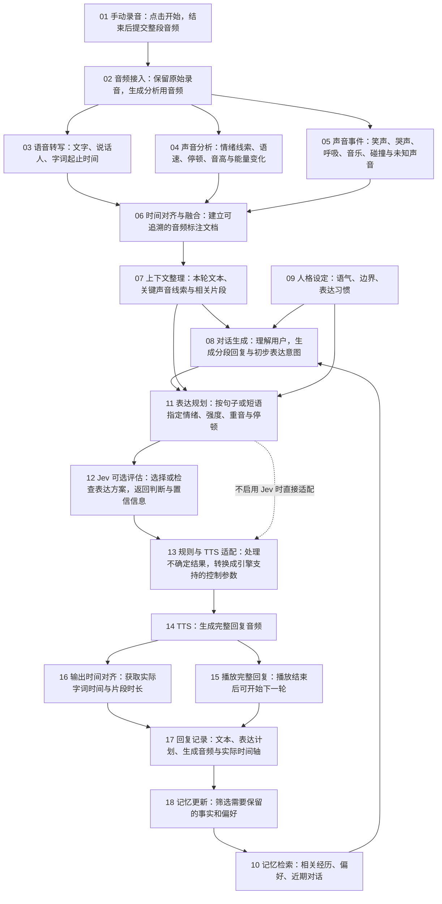
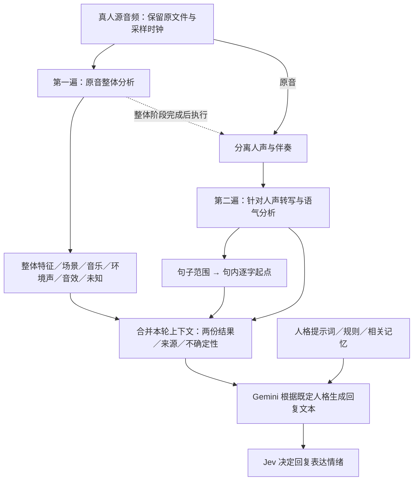

# 情绪语音系统：可编辑流程草案

这份初版采用手动录音、逐轮处理：点击开始录音，点击结束并提交，等待系统分析与生成，再播放完整回复。播放完成后开始下一轮。图中编号可用于后续添加、拆分或连接模块。



## 设计中需要区分的概念

1. **原始音频与分析结果分别保存。** 音频标注不可能完整还原原始声音；文档保留音频引用，必要时回到原始片段。给文本模型提供文字化或结构化线索；只有支持音频输入的模型才能直接使用音频。
2. **字词时间与情绪片段分别标注。** 字词级时间用于定位；情绪通常先标在短语或片段上。一个字可以引用所属情绪片段，不能把复制到每个字的标签误认为逐字独立识别。ASR 本身不一定支持情绪分析或可靠字级时间，必要时分别增加情绪模型与强制对齐模块。
3. **声音事件允许重叠与未知。** 笑声、音乐和讲话可以同时出现。记录起止时间、来源与置信信息；音高、能量、频谱等描述是声音线索，不能直接等同于情绪。是否增加音乐、节奏或特定声音分析模块，由实际需要决定。
4. **Jev 是可选的表达决策或检查模块。** 由生成式模型先提出分段表达计划，Jev 对有限的情绪、强度或回应策略选项进行判断。它不承担逐字自由生成，也不能单凭文本确定自然发声的准确时间。避免每个字单独调用。
5. **计划时间与实际时间分开。** 合成前可以指定期望语速、停顿或时长约束；具体支持范围由 TTS 决定。实际字词起止时间要从 TTS 获取，或在生成音频后通过强制对齐估计，并保留误差说明。
6. **初版按完整轮次处理。** 用户手动结束录音并提交后，系统依次完成分析、回复生成和音频合成，再播放回复。处理与播放期间禁用新录音入口；完成后恢复入口。录音、处理或播放失败时显示错误并恢复入口，供用户重试。

## 可扩展的数据层

| 数据层 | 建议保存的内容 |
|---|---|
| 原始音频 | 音频引用、采样率、声道、会话与轮次标识、以本段音频起点为零的时间基准 |
| 字词转写 | 文本、开始/结束时间、说话人标识（如可用）、时间来源 |
| 情绪与韵律片段 | 时间区间、候选情绪、强度或线索、模型来源、置信信息（如可用） |
| 声音事件 | 类型、时间区间、来源、置信信息、关联音频片段，允许未知与重叠 |
| 对话输入 | 本轮内容、关键声音线索、相关记忆、人格设定、信息缺失情况 |
| 回复表达计划 | 分段文本、目标语气、情绪强度、重音、期望语速、计划停顿 |
| 合成与播放记录 | 音频引用、实际字词时间、对齐来源、是否播放完成 |

不同模型的分数含义可能不同，不能直接当作同一种概率比较。未经校准的情绪判断应保留为候选解释。

## 后续添加流程的方法

在上方 Mermaid 代码中添加一个唯一编号的节点，并连接到已有节点，例如：

```text
    X01["20 新增模块名称"]
    A06 --> X01
    X01 --> A07
```

如果新增模块替代原来的直连路径，再删除 `A06 --> A07`。也可以直接提出“在 06 与 07 之间加入某模块”，继续修改这份文件。


## 当前输入目标流程：原音整体分析与人声分析（D36，2026-10-03）

本节是用户新提出的设计调整，不代表新增阶段已实现或验收通过。上方初版流程保留作历史参考；当前顺序以本节和 docs/decisions.md 的 D36 为准。



原音整体分析不能只分析分离后的伴奏：人声和其他声音的关系、笑声/呼吸/哭声等也属于情境。整体阶段首先沿用已选 Gemini 音频模型，提取可听见的候选场景和声音事件；人声阶段保留原文和可用的语气/句字定位。两份数据标明 original_mix/isolated_vocals，冲突显式保留，没有支持的时间或置信分数保持未知。人格规则保持稳定，本轮音频是上下文。

已运行：单段真人录音的本地分离和人声转写；用户初步认为分离不错。待接通：整体场景专用结果、双结果上下文、句子定位/逐句起点和真实人格回复。新真人例子用于扩大分离试听，结构检查不代表音质或识别质量。TTS 自定义音色对比仍暂停。
